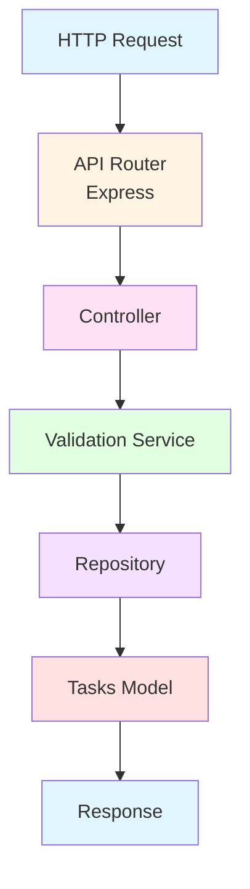
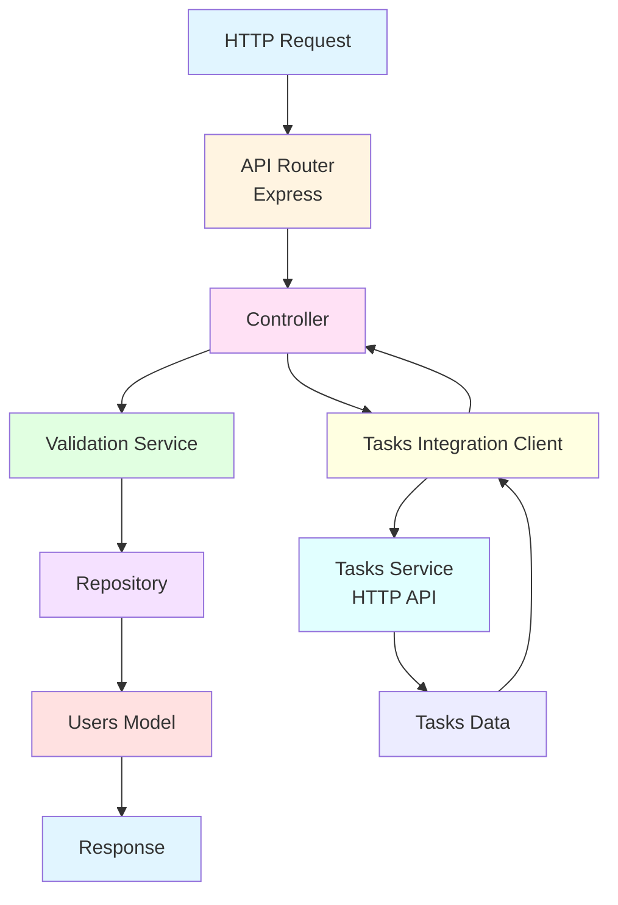
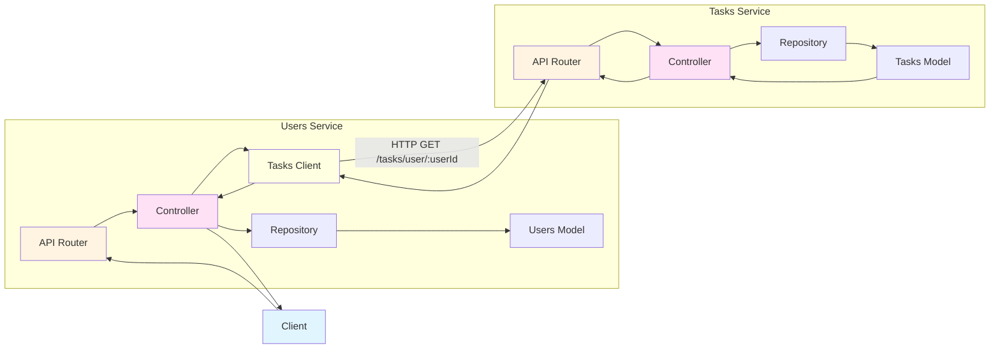
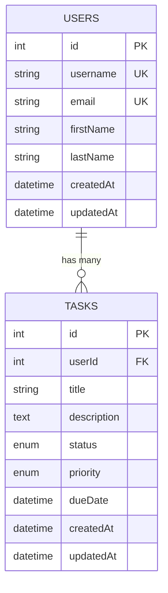
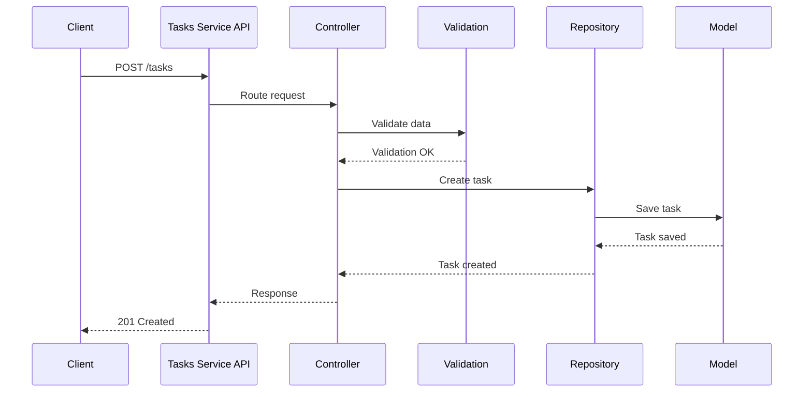
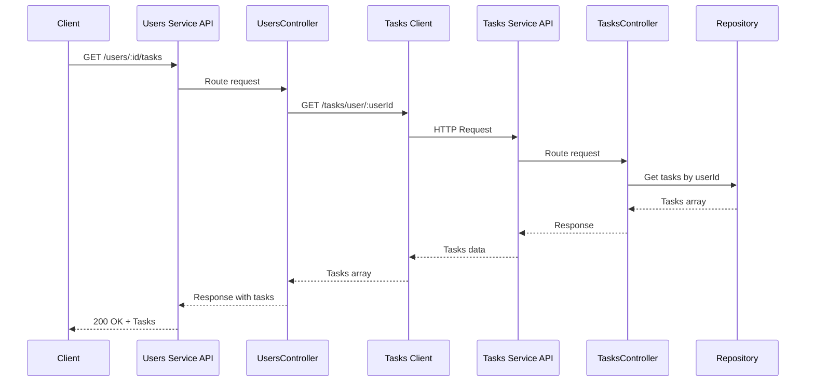
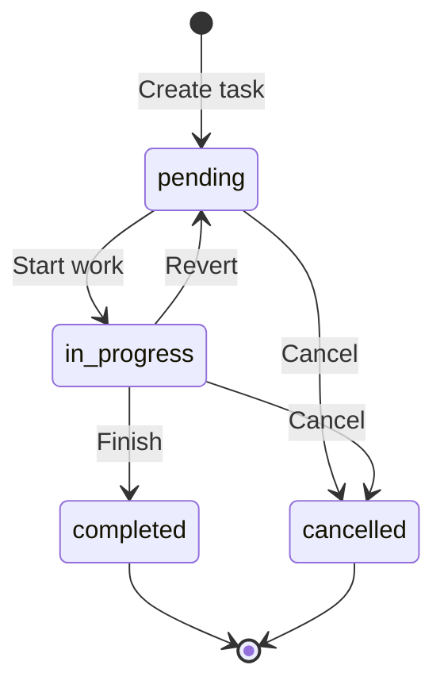
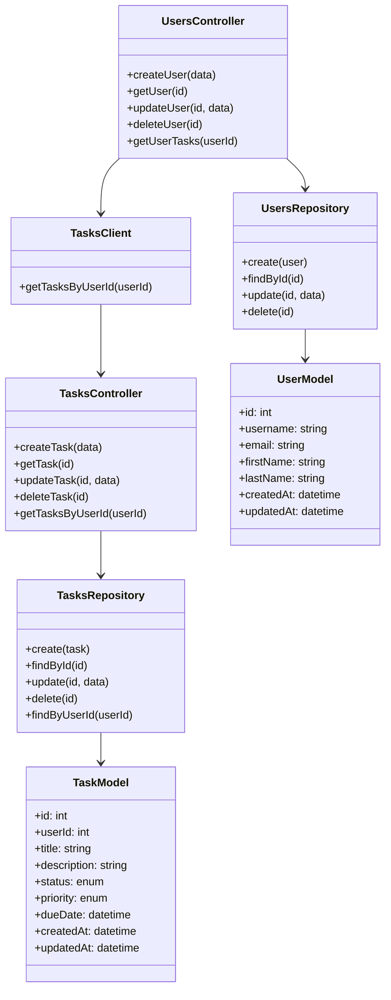

# Візуальні діаграми системи

## Діаграма компонентів - Tasks Service

## Діаграма компонентів - Users Service

## Системна діаграма взаємодії сервісів

## ER-діаграма

## Діаграма послідовності - Створення завдання

## Діаграма послідовності - Отримання завдань користувача

## Діаграма станів - Завдання

## Діаграма класів (UML-подібна)

